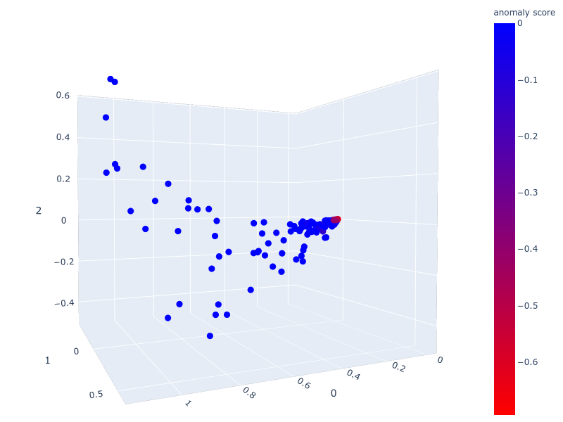
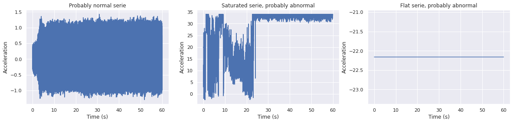

# Unsupervised anomaly detection challenge on accelerometer data 

The notebook of this folder presents a solution for an unsupervised anomaly detection task on accelerometer data that were acquired during helicopter flights.

This exercice was presented as a data challenge competition during my Post Master program in Big Data at Télécom Paris. I ranked 2nd out of 51 participants.

The notebook has been redacted in french but you can find the corresponding english article in my portfolio here : https://antonindurieux.github.io/portfolio/2_accelerometer_anomaly_detection/.

## Usage

The whole code and explanation is in the [Data_challenge-Detection_anomalies_non_supervisee.ipynb](https://github.com/antonindurieux/data_challenge-unsupervised_anomaly_detection/blob/master/Data_challenge-Detection_anomalies_non_supervisee.ipynb) notebook.

## Data

The data is voluminous and thus hasn't been uploaded on this Github repo.  
It consists 4188 time-series of accelerometer data, that were acquired during helicopter flights. Each observation was a 1 minute recording, sampled at 1024 Hz.

## Content
- Data import
- Statistical features extraction
- Extraction of frequency information
- Anomaly scores calculation
- Other approaches and kernel-PCA
